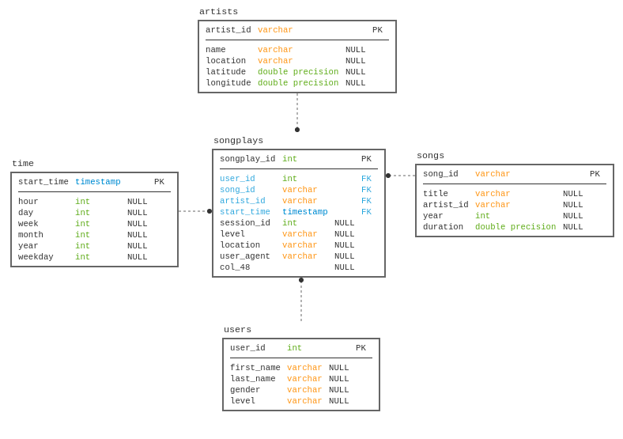

# Data Lake

This is the solution to the project **Data Lake** of Udacity's [Data Engineering Nanodegree](https://www.udacity.com/course/data-engineer-nanodegree--nd027).

## Introduction

The purpose of this project is to build an ETL pipeline to extract data from an S3 bucket, process them with Spark and write in a star schema format using `.parquet` files back into S3. The resulting files are meant to be able to provide fast queries to analyze song play data from the startup Sparkify.

## Resources

* `etl.py` is a script to run the ETL process using the credentials provided in the file `dl.cfg`.
* The `dl.cfg` file should have the following structure and its values must be filled in.

```ini
[AWS]
ACCESS_KEY_ID=
SECRET_ACCESS_KEY=
```

## Executing ETL process

The `etl.py` script uses `pyspark` to read log and song data from a S3 bucket, process them into a star schema organized as the tables `time`, `artists`, `songs`, `users` and `songplays`. The resulting datasets are then written in `.parquet` files and uploaded to a S3 bucket.

The output files are partitioned using the following rules:
* `songplays.parquet` is partitioned by `year` and `month`.
* `songs.parquet` is partitioned by `year` and `artist_id`.
* `time.parquet` is partitioned by `year` and `month`.


## Data Model

The data model chosen to represent the data processed by the ETL is the following:




